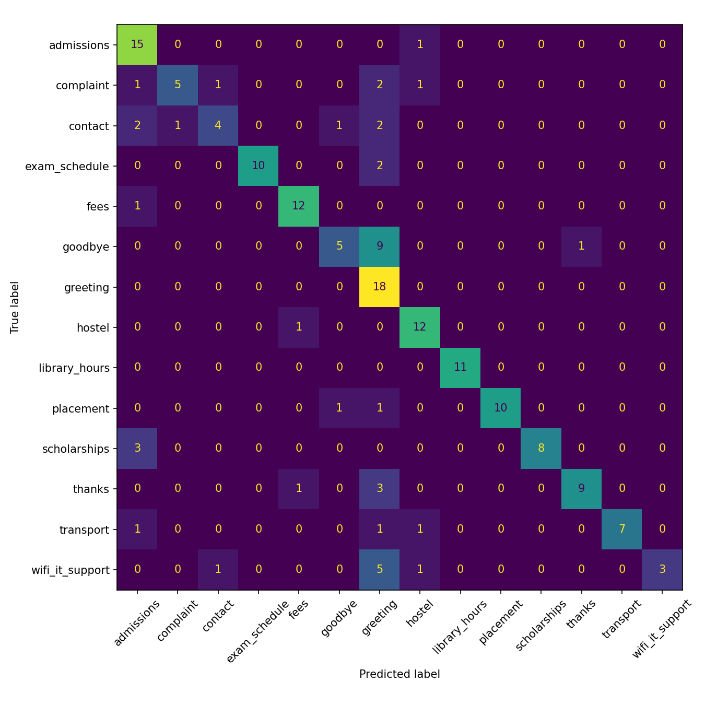

# Campus Helpdesk Chatbot (NLP Course Project)

[](https://github.com/DHAIRYA027/NLP-PROJECT/actions/workflows/ci.yml)
[](LICENSE)
[](requirements.txt)

A conversational chatbot that answers common college queries (admissions, library
hours, fees, hostel, exams, placements, scholarships, transport, IT support, and
complaints) and demonstrates core NLP fundamentals end to end — implemented from
scratch rather than wrapping a pretrained LLM.

**[Live demo →](#)** <!-- replace with your Streamlit Cloud URL after deploying, see "Deploying" below -->

## Architecture

```
user input
   |
   v
preprocessing (tokenize, remove stopwords, lemmatize)   -- src/preprocess.py
   |
   v
intent classification (TF-IDF + choice of NB / LogReg / SVM) -- src/intent_classifier.py
   |
   +-- confidence >= threshold --> template response (from data/intents.json)
   |
   +-- confidence <  threshold --> n-gram language model generates a reply
                                    (Markov assumption, add-k or interpolated
                                     smoothing)                                -- src/ngram_model.py
```

Orchestration lives in `src/chatbot.py`; `app.py` is a Streamlit chat UI on top of it.

## NLP concepts this covers

- **Tokenization, stopword removal, lemmatization** (`preprocess.py`)
- **Bag-of-Words / TF-IDF** vectorization (`intent_classifier.py`)
- **Three classifier families compared head-to-head**: Naive Bayes, Logistic Regression, Linear SVM
- **N-gram language modeling** — Markov assumption, both **add-k (Laplace)** and **linear interpolation** smoothing, perplexity as an evaluation metric (`ngram_model.py`)
- **Text generation** via sampling from a probability distribution over next words

## Results

Full methodology and error analysis in **[REPORT.md](REPORT.md)**. Summary:

| Intent classifier | Accuracy | Macro F1 |
|---|---|---|
| Naive Bayes (baseline) | 0.741 | 0.742 |
| **Logistic Regression** | **0.782** | **0.792** |
| Linear SVM | 0.776 | 0.777 |

| LM smoothing (n=3) | Perplexity |
|---|---|
| Add-k (Laplace) | 559.16 |
| **Linear interpolation** | **261.07** |



## Setup

```bash
git clone https://github.com/DHAIRYA027/NLP-PROJECT.git
cd NLP-PROJECT
python3 -m venv venv
source venv/bin/activate
pip install -r requirements.txt
```

First run downloads a few small NLTK data packages automatically (punkt, stopwords, wordnet).

## Usage

**Command-line chat:**
```bash
python -m src.chatbot
```

**Web UI:**
```bash
streamlit run app.py
```

**Train/inspect the classifier alone:**
```bash
python -m src.intent_classifier
```

**Train/inspect the language model alone:**
```bash
python -m src.ngram_model
```

**Run the full evaluation (classifier comparison + confusion matrix + LM perplexity):**
```bash
python -m src.evaluate
```
Results are written to `results/confusion_matrix.png` and `results/metrics.json`.

## Testing

```bash
pip install -r requirements-dev.txt
pytest -v
```

31 tests cover preprocessing, all three classifier backends, both LM smoothing
strategies, and the end-to-end chatbot flow. CI runs this suite (and the full
evaluation script) on every push across Python 3.10–3.12 — see the badge above.

## Project layout

```
NLP-PROJECT/
├── .github/workflows/ci.yml   tests + evaluation on every push
├── app.py                     Streamlit chat UI
├── data/
│   ├── intents.json           14 intents, 174 patterns + template responses
│   └── corpus.txt             ~2,000-word corpus for the n-gram LM
├── src/
│   ├── preprocess.py          tokenization, stopwords, lemmatization
│   ├── intent_classifier.py   TF-IDF + NB / LogReg / SVM intent classifier
│   ├── ngram_model.py         n-gram LM: add-k and interpolation smoothing
│   ├── chatbot.py             ties everything together
│   └── evaluate.py            classifier comparison + LM perplexity comparison
├── tests/                     pytest suite (31 tests)
├── results/                   confusion_matrix.png, metrics.json
├── REPORT.md                  full evaluation writeup with error analysis
└── requirements.txt / requirements-dev.txt
```

## Deploying (for the live demo link)

1. Push this repo to GitHub (already done).
2. Go to [share.streamlit.io](https://share.streamlit.io), sign in with GitHub.
3. "New app" → pick this repo, branch `main`, main file path `app.py`.
4. Deploy. Copy the resulting URL into the "Live demo" link at the top of this README.

## Extending it further

- Try **Kneser-Ney** smoothing and compare against the interpolation results in `REPORT.md`.
- Add more intents/patterns, especially more varied `goodbye` and `wifi_it_support`
  examples — `REPORT.md` shows exactly why those two are the weakest classes.
- Swap TF-IDF for word embeddings (e.g. spaCy vectors) to address the lexical-overlap
  failure mode described in the error analysis.
- Add a simple **spell-correction** step before classification (edit distance) as
  another classical-NLP component.

## Notes

- The dataset is hand-written and still small by NLP standards — `REPORT.md` is
  explicit about what that does and doesn't tell you.
- The n-gram model's generated fallback text is intentionally rough — it's meant to
  demonstrate statistical language modeling, not to be fluent. That's the honest
  tradeoff of not using a pretrained model, and `REPORT.md` says so directly.
